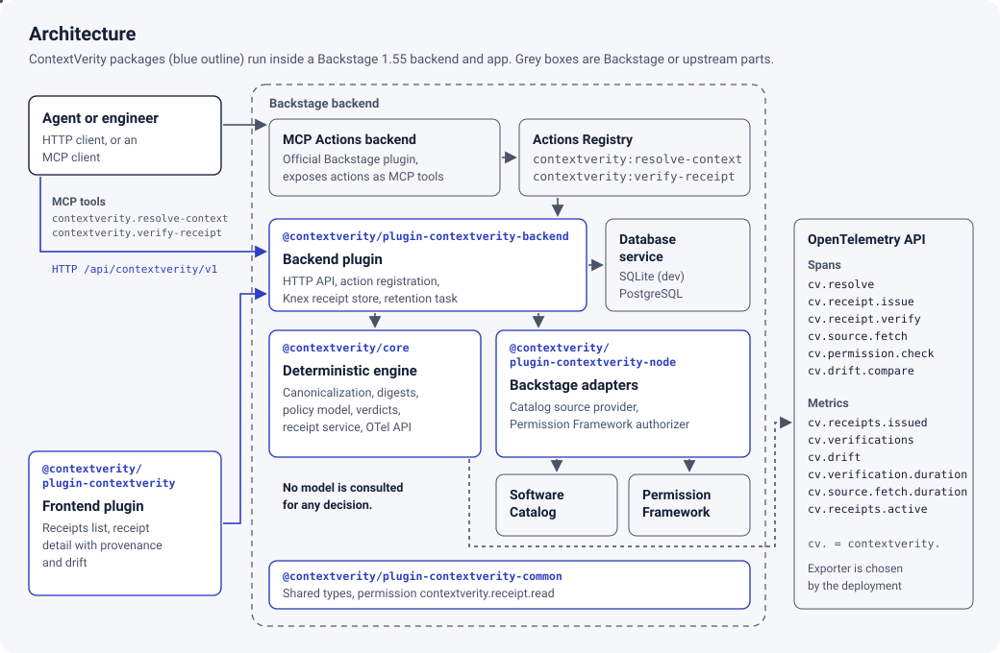

<p align="center">
  <picture>
    <source media="(prefers-color-scheme: dark)" srcset="docs/assets/logo-dark.svg">
    
  </picture>
</p>

<h3 align="center">Trust the context before the agent does.</h3>

<p align="center">Fresh, scoped and verifiable context for AI agents.</p>

<p align="center">
  <a href="https://contextverity.github.io/">Website</a> ·
  <a href="https://contextverity.github.io/demo/">Demo</a> ·
  <a href="https://contextverity.github.io/results/">Results</a> ·
  <a href="docs/architecture.md">Architecture</a> ·
  <a href="docs/limitations.md">Limitations</a>
</p>

<p align="center">
  <a href="LICENSE"></a>
  
  
  <a href="https://www.npmjs.com/package/@contextverity/core"></a>
  
</p>

<p align="center">
  
</p>

An agent may retrieve the right owner, API, dependency and runbook — and still be
wrong by the time it acts.

ContextVerity records what context was issued and deterministically checks whether
the source state, scope and permissions still hold before that context is reused.

```
FETCH ─► ContextSnapshot ─► ContextReceipt ─► (something changes) ─► VERIFY ─┬─ VALID
                                                                             ├─ REFRESH
                                                                             └─ DENY
```

ContextVerity is an independent Apache-2.0 open-source project built using open
technologies from the Backstage, CNCF and Linux Foundation ecosystems. It is not a
CNCF project, not an official Backstage project, and not yet used in production.

## Why ContextVerity?

Developer platforms such as [Backstage](https://backstage.io/) are becoming the
place agents read operational context from: who owns a service, which APIs it
provides, what it depends on, how sensitive it is. That context is correct when it
is fetched. Between fetch and action, owners change, APIs are deprecated, entities
are deleted and recreated, permissions are revoked and classifications rise.

The agent's reasoning can be sound and its action still wrong, because the context
it reasoned over no longer holds. ContextVerity makes that state explicit and asks
one question, deterministically and without a language model:

> Is the context the agent is about to rely on still current, in scope and permitted?

## How it works

<p align="center">
  <picture>
    <source media="(prefers-color-scheme: dark)" srcset="docs/assets/context-flow-dark.svg">
    
  </picture>
</p>

1. **Resolve.** A consumer (user or agent) asks for context about a subject for a
   declared purpose and set of categories. ContextVerity selects the matching
   [context policy](docs/context-grants.md), checks `catalog.entity.read` through the
   Backstage Permission Framework with the caller's credentials, reads the catalog,
   normalizes each source into a record, and computes SHA-256 digests over a
   canonical JSON form.
2. **Receipt.** It stores an immutable, server-authoritative
   [ContextReceipt](docs/context-receipts.md) — references, normalized decision inputs,
   digests, permission decisions, policy revision, expiry — with an integrity tag.
   The caller gets the context and a receipt ID.
3. **Verify.** Before acting, the consumer calls verify. ContextVerity re-checks the
   receipt's binding (consumer, issuer, integrity), the intended subject, purpose and
   scope, the current policy, the TTL, the consumer's _current_ permissions, and the
   current source state, and returns typed [drift](docs/context-model.md#drift) and a
   [verdict](docs/context-verdicts.md).

| Verdict   | Meaning                                                                                                                          |
| --------- | -------------------------------------------------------------------------------------------------------------------------------- |
| `VALID`   | The context matched source, permission and policy state **at verification time**. Not a guarantee about the future.              |
| `REFRESH` | The context is no longer current, but nothing indicates the consumer is prohibited from it. Resolve fresh context before acting. |
| `DENY`    | Current authorization, classification, binding or policy no longer permits this context for this use.                            |

The verdict is the strongest effect among the drift items. Every rule is in
[docs/context-verdicts.md](docs/context-verdicts.md); no rule is learned or inferred.

## Results

Every number below is generated from [`test-results/`](test-results/) by
`make test-results`; nothing is typed by hand. The scenarios are synthetic and run
on a single machine — perfect scores in this scope do not imply production
statistical confidence. Full tables: [docs/results.md](docs/results.md) and the
[results page](https://contextverity.github.io/results/).

<!-- results:start -->

**Live Backstage lab** (Backstage 1.55.0, synthetic data): 45/45 executed scenarios passed (5 of 50 need a controllable clock, outage injection, restart or second issuer and run in-process only). Stale-context detection 100.0% (30/30), false invalidation 0.0% (0/10), false acceptance 0.0% (0/30).

**On Kubernetes** (Helm chart on kind v0.32.0 with Podman, Kubernetes v1.36.1): 46/46 executed scenarios passed, including a pod restart with the receipt surviving on the persistent volume (4 need a controllable clock, outage injection or second issuer). Stale-context detection 100.0% (30/30), false invalidation 0.0% (0/11), false acceptance 0.0% (0/30).

**In-process core** (synthetic catalog, Knex/SQLite store): 50/50 scenarios passed. Stale-context detection 100.0% (34/34), false invalidation 0.0% (0/11), false acceptance 0.0% (0/34).

**In-process verification latency** (p50 / p95): 1 source 0.395 / 0.622 ms; 5 sources 0.51 / 0.747 ms; 10 sources 0.518 / 0.803 ms.

**Live-lab verification latency, end-to-end HTTP, development-mode backend** (p50 / p95): 1 source 18.943 / 28.052 ms; 5 sources 20.204 / 29.316 ms; 10 sources 5.879 / 10.609 ms.

_Commit [`3066e49849ca`](https://github.com/contextverity/contextverity/commit/3066e49849cac84e074419f106474ed920c7c4f3), generated 2026-10-08T10:58:34.075Z._

<!-- results:end -->

## Quick start

Prerequisites: Node.js 22 or 24, `make`, `git`. No cloud account, no LLM key.

```sh
git clone https://github.com/contextverity/contextverity
cd contextverity
make install        # yarn 4 from the repo, lockfile enforced
make demo-up        # local Backstage lab: catalog, permissions, MCP actions, ContextVerity
make demo-run       # scripted demo; every line is a real API response
make demo-mcp       # the same pattern through Backstage's official MCP Actions endpoint
make demo-down
```

Then open <http://127.0.0.1:3000/contextverity>, sign in as guest, and inspect the
receipts the demo created.

**On Kubernetes, with Podman** (kind's Podman provider, Helm 3.8+ or 4, kubectl
within one minor version of the cluster):

```sh
make k8s-up         # podman build, kind cluster on Podman, helm install, helm test
make k8s-test       # the scenarios against the cluster
make k8s-down
```

The chart (`deploy/helm/contextverity-lab`) runs non-root with a read-only root
filesystem, probes, resource limits, a NetworkPolicy and no RBAC; see
[docs/deployment.md](docs/deployment.md).

```text
[1] Resolve context for component:default/payments (purpose: incident-triage)
    Owner:        group:default/team-payments
    Sensitivity:  INTERNAL
    Receipt:      cv-…
[2] Verify without changes
    VALID
[3] Change owner in the catalog
[4] Verify the old receipt
    REFRESH
    reason: OWNER_CHANGED  owner: "group:default/team-payments" -> "group:default/team-commerce"
[6] Verify after classification INTERNAL -> RESTRICTED
    DENY
    reason: CLASSIFICATION_RAISED
[8] Verify after the consumer's catalog read permission is revoked
    DENY
    reason: PERMISSION_REVOKED
```

(Abridged; `make demo-run` prints the full output from the running lab.)

## Backstage integration

ContextVerity is a set of Backstage plugins built on the
[new backend system](https://backstage.io/docs/backend-system/) and the
[new frontend system](https://backstage.io/docs/frontend-system/), tested against
Backstage 1.55.

| Package                                                                        | Role                                                                                                                                                           |
| ------------------------------------------------------------------------------ | -------------------------------------------------------------------------------------------------------------------------------------------------------------- |
| [`@contextverity/core`](plugins/contextverity-core)                            | Provider-neutral engine: canonicalization, digests, policy model, verdict engine, receipt service, OpenTelemetry API instrumentation. No Backstage dependency. |
| [`@contextverity/plugin-contextverity-common`](plugins/contextverity-common)   | Shared types, drift codes, the `contextverity.receipt.read` permission.                                                                                        |
| [`@contextverity/plugin-contextverity-node`](plugins/contextverity-node)       | Backstage catalog source provider, Permission Framework authorizer, Knex receipt store.                                                                        |
| [`@contextverity/plugin-contextverity-backend`](plugins/contextverity-backend) | Backend plugin: HTTP API, policies, retention, Actions Registry actions.                                                                                       |
| [`@contextverity/plugin-contextverity`](plugins/contextverity)                 | Frontend plugin: receipts list and receipt detail (provenance, permissions, drift).                                                                            |

```sh
yarn --cwd packages/backend add @contextverity/plugin-contextverity-backend
yarn --cwd packages/app add @contextverity/plugin-contextverity
```

The packages are on npm with
[provenance](https://docs.npmjs.com/generating-provenance-statements) linking each
version to the GitHub Actions run that built it.

```ts
// packages/backend/src/index.ts
backend.add(import('@contextverity/plugin-contextverity-backend'));

// packages/app/src/App.tsx
import contextverityPlugin from '@contextverity/plugin-contextverity';
createApp({ features: [catalogPlugin, contextverityPlugin] });
```

```yaml
# app-config.yaml
contextverity:
  issuer: my-backstage-prod
  policyFile: ./context-policies.yaml
  integritySecret: ${CONTEXTVERITY_INTEGRITY_SECRET}
```

See [docs/backstage-integration.md](docs/backstage-integration.md) for the API,
permissions and catalog annotation (`contextverity.github.io/classification`).

### MCP

ContextVerity does **not** ship an MCP server. It registers two actions in the
Backstage Actions Registry — `contextverity:resolve-context` and
`contextverity:verify-receipt` — which Backstage's official
[MCP Actions backend](https://github.com/backstage/backstage/tree/master/plugins/mcp-actions-backend)
exposes as MCP tools. Backstage offers no supported hook for intercepting other
plugins' actions, so the integration is explicit: an agent verifies its receipt
and acts only on `VALID`. See [docs/adr/0006-mcp-integration-boundaries.md](docs/adr/0006-mcp-integration-boundaries.md).

## Receipt example

```json
{
  "receiptId": "cv-7389fed1-aad6-4909-ab28-9dbad3c2ec26",
  "issuer": "lab-local",
  "issuedAt": "2026-10-08T09:53:41.982Z",
  "validUntil": "2026-10-08T10:08:41.982Z",
  "consumer": "user:default/alex",
  "subject": "component:default/payments",
  "purpose": "incident-triage",
  "grant": {
    "policyId": "incident-triage",
    "policyDigest": "sha256:42eaa68d…",
    "categories": [
      "api-definition",
      "apis",
      "dependencies",
      "lifecycle",
      "ownership"
    ],
    "sensitivityCeiling": "INTERNAL",
    "ttlSeconds": 900
  },
  "sources": [
    {
      "sourceId": "catalog:component:default/payments",
      "kind": "CATALOG_ENTITY",
      "identity": "4487e099-b723-4a24-ab1f-6e03ae62e2e2",
      "classification": "INTERNAL",
      "fields": {
        "owner": {
          "category": "ownership",
          "value": "group:default/team-payments"
        }
      },
      "digest": "sha256:ad037d25…"
    },
    {
      "sourceId": "apidef:api:default/payments-api",
      "kind": "API_DEFINITION",
      "fields": {
        "definitionDigest": {
          "category": "api-definition",
          "value": "sha256:e1e399f3…"
        }
      }
    }
  ],
  "permissions": [
    {
      "permission": "catalog.entity.read",
      "resourceRef": "component:default/payments",
      "result": "ALLOW",
      "basis": "permission-policy"
    }
  ],
  "snapshotDigest": "sha256:4efd60b8…"
}
```

(Abridged.) Receipts hold references, normalized decision inputs and digests —
never API definition bodies, documents, secrets or tokens. The server copy is
authoritative; a client-edited copy is irrelevant to verification
([ADR 0001](docs/adr/0001-receipt-authority-and-integrity.md)).

## Drift example

```json
{
  "verdict": "REFRESH",
  "drift": [
    {
      "code": "OWNER_CHANGED",
      "effect": "REFRESH",
      "sourceId": "catalog:component:default/payments",
      "field": "owner",
      "before": "group:default/team-payments",
      "after": "group:default/team-commerce",
      "detail": "owner changed"
    }
  ]
}
```

<p align="center">
  <picture>
    <source media="(prefers-color-scheme: dark)" srcset="docs/assets/drift-verdict-dark.svg">
    
  </picture>
</p>

## Open-source ecosystem

ContextVerity integrates only these projects in runnable code:

| Project                                                                                                      | Role in ContextVerity                                                                                            | Governance                                                              |
| ------------------------------------------------------------------------------------------------------------ | ---------------------------------------------------------------------------------------------------------------- | ----------------------------------------------------------------------- |
| [Backstage](https://backstage.io/) ([repo](https://github.com/backstage/backstage))                          | Context source (Software Catalog), Permission Framework, Actions Registry, plugin runtime                        | CNCF Incubating ([cncf.io](https://www.cncf.io/projects/backstage/))    |
| [OpenTelemetry](https://opentelemetry.io/) ([repo](https://github.com/open-telemetry/opentelemetry-js))      | Traces and metrics for resolution and verification; spans nest under Backstage's MCP `tools/call` spans          | CNCF Graduated ([cncf.io](https://www.cncf.io/projects/opentelemetry/)) |
| [Model Context Protocol](https://modelcontextprotocol.io/) ([repo](https://github.com/modelcontextprotocol)) | Agent tool path, via Backstage's official MCP Actions backend; reference client uses the official TypeScript SDK | Linux Foundation, Agentic AI Foundation                                 |

Versions and API stability: [docs/upstream-compatibility.md](docs/upstream-compatibility.md).
All direct dependencies and licenses: [DEPENDENCIES.md](DEPENDENCIES.md).

## Threat model and limitations

ContextVerity detects configured source and authorization drift before receipt
reuse. It does **not**:

- make verification transactional — `VALID` can go stale before the action (TOCTOU);
- intercept other plugins' actions or MCP tools — callers must verify explicitly;
- judge whether natural-language content is true or safe — it is not a
  prompt-injection or hallucination detector;
- infer sensitivity — classification is declared by catalog owners;
- see an individual agent's identity through the MCP Actions backend when the agent
  uses a static token (Backstage forwards it as `plugin:mcp-actions`); and it has
  no production adopters yet.

Read [docs/limitations.md](docs/limitations.md), [docs/threat-model.md](docs/threat-model.md)
and [docs/security-model.md](docs/security-model.md).

## Architecture

<p align="center">
  <picture>
    <source media="(prefers-color-scheme: dark)" srcset="docs/assets/architecture-dark.svg">
    
  </picture>
</p>

Design and decisions: [docs/architecture.md](docs/architecture.md),
[docs/design.md](docs/design.md), [docs/adr/](docs/adr/).

## Development

```sh
make verify          # format, lint, typecheck, unit + integration tests
make test-e2e        # the 50 scenarios against the running lab (make demo-up first)
make test-results    # regenerate test-results/ and the results section above
make benchmark       # in-process benchmarks
```

See [docs/development.md](docs/development.md) and [docs/testing.md](docs/testing.md).

## Contributing

Contributions are welcome — see [CONTRIBUTING.md](CONTRIBUTING.md),
[GOVERNANCE.md](GOVERNANCE.md), [ROADMAP.md](ROADMAP.md) and the
[Code of Conduct](CODE_OF_CONDUCT.md). Report vulnerabilities privately as described
in [SECURITY.md](SECURITY.md).

## License

[Apache License 2.0](LICENSE).
