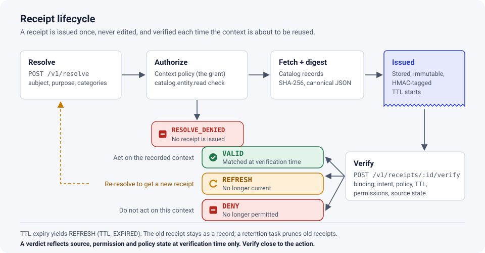

# Context receipts

A `ContextReceipt` is the immutable, server-authoritative record of exactly what
context was issued to whom, for what, and under which policy.

## Fields

| Field                    | Meaning                                                                                        |
| ------------------------ | ---------------------------------------------------------------------------------------------- |
| `receiptId`              | `cv-<uuid>`, generated with `crypto.randomUUID()`                                              |
| `issuer`                 | `contextverity.issuer` of the issuing instance                                                 |
| `schemaVersion`          | `1`                                                                                            |
| `issuedAt`, `validUntil` | ISO-8601 UTC, server clock; `validUntil = issuedAt + min(requested TTL, policy maxTtlSeconds)` |
| `consumer`               | Principal ref: `user:<ns>/<name>` or `service:<subject>`                                       |
| `subject`                | Normalized entity ref                                                                          |
| `purpose`                | Declared purpose                                                                               |
| `grant`                  | The [ContextGrant](context-grants.md) that applied                                             |
| `sources`                | Normalized source records (fields in granted categories, digests, identity, classification)    |
| `permissions`            | Permission decisions evaluated at issue time, with their basis                                 |
| `classification`         | Highest classification across sources                                                          |
| `snapshotDigest`         | SHA-256 over issuer, binding, grant, per-source digests and classification                     |

## What a receipt never contains

API definition bodies (only their digest), documentation content, secrets, tokens,
credentials, or fields outside the granted categories. Normalized values such as
owner refs and dependency refs _are_ stored, because verification and the UI need
them to explain drift ("owner: team-payments → team-commerce").

## Authority and integrity

The stored receipt is authoritative. Clients receive the receipt as a _view_ and
the `receiptId`; verification always loads the stored copy, so editing a client copy
has no effect.

Each stored receipt carries an integrity tag over its canonical JSON:

- `hmac-sha256:<hex>` when `contextverity.integritySecret` is configured — detects
  edits by anyone without the secret (including someone with database write access);
- `sha256:<hex>` otherwise — detects corruption and naive edits only.

With a secret configured, an unkeyed tag is rejected (no downgrade). A failed check
yields `RECEIPT_INTEGRITY_FAILED` → `DENY`, compares no source state, and is not
recorded as a verification (scenario S30). The tag is computed with Node's standard
`crypto` module; ContextVerity implements no cryptography of its own. It is not a
portable signature: receipts cannot be verified outside the issuing instance. See
[ADR 0001](adr/0001-receipt-authority-and-integrity.md).

## Lifecycle

1. **Issued** by `POST /v1/resolve`.
2. **Verified** any number of times by its consumer (`POST /v1/receipts/:id/verify`);
   each result, including the verifying principal, is appended to
   `contextverity_verifications`. Attempts that fail binding (another consumer,
   another issuer, failed integrity) return DENY but are **not** recorded, so they
   cannot alter the receipt's history.
3. **Inspected** by operators with `contextverity.receipt.read`
   (`POST /v1/receipts/:id/inspect`) — not recorded, permissions not re-evaluated.
4. **Expired** at `validUntil` (verification then returns `TTL_EXPIRED`). Expiry does
   not delete the receipt.
5. **Deleted** by the retention task once older than `contextverity.retention.days`
   (default 30), together with its verifications.

## Retention

The `contextverity-retention` scheduled task runs hourly and deletes receipts issued
before `now - retention.days`. With multiple backend replicas, Backstage's scheduler
runs it on one replica at a time.
